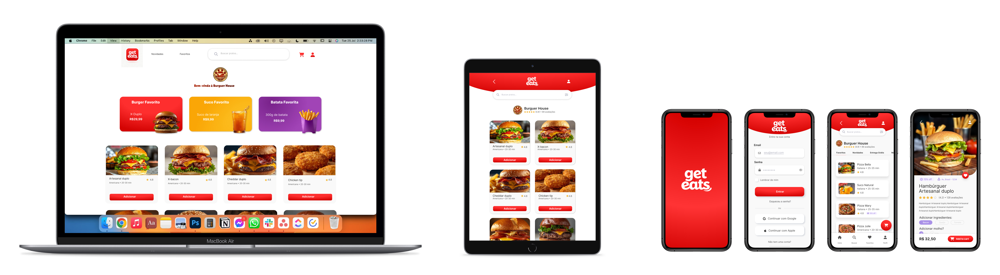
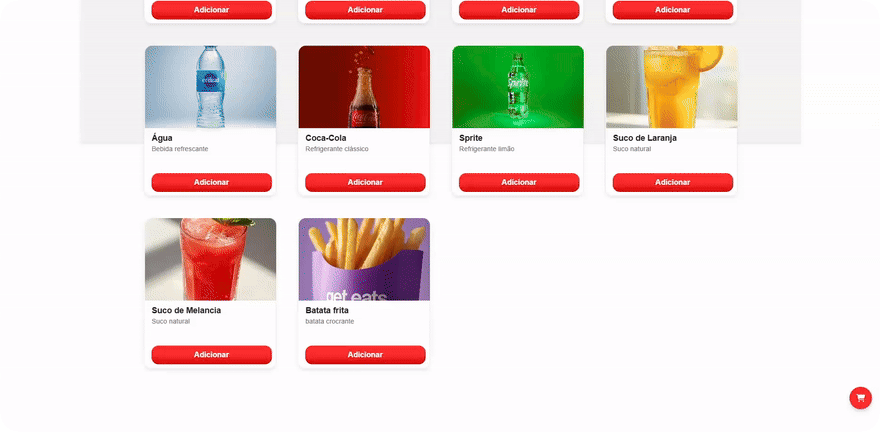

<p align="center">
  
</p>

<hr />

<h3 align="center">Delivery web responsivo com cardapio digital, carrinho, pagamento simulado e painel administrativo</h3>

<p align="center">
  
</p>

<p align="center">
  O Get Eats simula uma operacao real de delivery: catalogo de produtos, busca, favoritos,
  carrinho, checkout, acompanhamento de pedido, historico por usuario e administracao local do cardapio.
</p>

<p align="center">
  
  
  
  
  
</p>

<p align="center">
  
  
  
  
</p>

<p align="center">
  <a href="https://luxury-cat-6c9b24.netlify.app/">Demo em producao</a>
  &middot;
  <a href="docs/context-geteats.md">Documentacao do projeto</a>
  &middot;
  <a href="src/admin.html">Area administrativa</a>
</p>

<p align="center">
  
</p>

> Status: MVP tecnico funcional em validacao. O projeto demonstra fluxo de compra digital, responsividade, persistencia local e experiencia de produto, mas ainda nao deve ser tratado como sistema real de producao sem backend, autenticacao segura, banco de dados e revisao de seguranca.

---

## Stack em destaque

<p align="center">
  
  
  
  
  
  
  
</p>

## Links

- Frontend em producao: https://luxury-cat-6c9b24.netlify.app/
- Repositorio: https://github.com/CelioPedro/Get-Eats
- Documentacao do projeto: [docs/context-geteats.md](docs/context-geteats.md)
- Entrada administrativa: [src/admin.html](src/admin.html)

## Visao do produto

O Get Eats apresenta uma hamburgueria digital com experiencia completa de navegacao. O usuario pode buscar produtos, favoritar itens, adicionar ao carrinho, aplicar cupom, simular pagamento e acompanhar o status do pedido. O historico de pedidos fica isolado por perfil, reforcando uma experiencia mais consistente entre contas diferentes.

O objetivo deste repositorio e apresentar a evolucao de um projeto academico para uma peca de portfolio com fluxo navegavel, responsividade e comportamento proximo de um produto real.

## Funcionalidades

- Cardapio com categorias, busca, filtros e produtos com imagens.
- Favoritos persistentes por usuario no navegador.
- Carrinho com quantidade, cupom, endereco e resumo de pedido.
- Cadastro, login e perfil de cliente simulados com `localStorage`.
- Pagamento simulado por PIX ou cartao.
- Acompanhamento de pedido com status progressivo.
- Historico de pedidos isolado por perfil de usuario.
- Modal desktop para carrinho, pagamento, pedidos e perfil.
- Painel administrativo para adicionar, editar e remover produtos.
- Layout responsivo para mobile, tablet e desktop.

## Telas principais

| Area | Descricao |
| --- | --- |
| Cardapio | Lista de produtos, busca, categorias, destaques e filtros. |
| Produto | Detalhes do item, adicionais, bebidas, acompanhamentos e favorito. |
| Carrinho | Itens selecionados, cupom, endereco e total. |
| Pagamento | Simulacao de pagamento por PIX ou cartao. |
| Pedidos | Pedidos atuais e historico separado por usuario. |
| Perfil | Dados do cliente, edicao de perfil, senha e logout. |
| Admin | Cadastro, edicao e remocao de produtos. |

## Como rodar localmente

O projeto e estatico. Voce pode abrir diretamente o arquivo [src/index.html](src/index.html), mas a forma mais estavel e rodar com um servidor local.

```bash
cd src
npx http-server .
```

Depois acesse:

```text
http://localhost:8080
```

## Area administrativa

A area administrativa e uma simulacao local para fins academicos e de demonstracao.

```text
Entrada: src/admin.html
Usuario: adm
Senha: adm
```

## Estrutura

```text
Get Eats/
+-- docs/
|   +-- demo/
|   +-- img/
+-- src/
|   +-- assets/
|   +-- paginas/
|   +-- recursos/
|       +-- css/
|       +-- js/
+-- README.md
```

## Decisoes de implementacao

- O projeto nao usa backend: sessao, usuarios, favoritos, carrinho e pedidos sao simulados no navegador.
- O historico de pedidos e separado por usuario usando chaves derivadas do email logado.
- O carrinho tambem e persistido localmente para manter o fluxo mesmo ao navegar entre telas.
- A interface desktop usa modais e paineis laterais para reduzir mudancas bruscas de pagina.
- A versao mobile prioriza fluxo linear, botoes grandes e navegacao inferior.

## Proximas melhorias

- Migrar dados para uma API real.
- Adicionar testes automatizados de fluxo.
- Melhorar acessibilidade de todos os modais.
- Criar estados vazios e mensagens de erro mais completas.
- Separar melhor os modulos JavaScript.
- Adicionar dominio customizado ao deploy.

## Autor

Desenvolvido por **Celio Pedro** como projeto academico e peca de portfolio.
