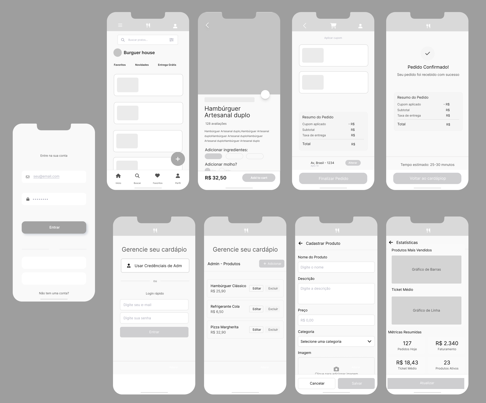

# Get Eats

Aplicacao web de delivery criada como projeto academico de 1o semestre em Sistemas de Informacao. O sistema simula a experiencia completa de uma hamburgueria: cardapio, carrinho, pagamento, acompanhamento de pedidos e painel administrativo para gerenciar produtos.



## Demo Local

O projeto e estatico e roda apenas com HTML, CSS, JavaScript e `localStorage`.

```bash
cd src
npx http-server .
```

Depois acesse `http://localhost:8080`.

Tambem e possivel abrir [src/index.html](src/index.html) diretamente no navegador, mas um servidor local evita bloqueios de carregamento de recursos em alguns ambientes.

## Funcionalidades

- Cardapio com categorias, busca e produtos com imagens.
- Carrinho persistido no `localStorage`, com quantidades, cupom e endereco.
- Cadastro e login de cliente simulados localmente.
- Pagamento simulado por PIX ou cartao.
- Acompanhamento e historico de pedidos.
- Painel administrativo para adicionar, editar e remover produtos.
- Interface responsiva para mobile, tablet e desktop.

## Area Administrativa

A area administrativa e uma simulacao local para fins academicos e de demonstracao.

- Entrada: [src/admin.html](src/admin.html)
- Credenciais: `adm` / `adm`

## Tecnologias

- HTML5
- CSS3
- JavaScript
- localStorage
- Git/GitHub

## Estrutura

- `src/`: aplicacao web.
- `src/paginas/`: telas do cliente e do administrador.
- `src/recursos/css/`: estilos globais, componentes e paginas.
- `src/recursos/js/`: logica de autenticacao, carrinho, produtos, pedidos e desktop.
- `src/assets/`: logos, icones e imagens de produtos.
- `docs/`: documentacao academica, wireframes e referencias.

## Aprendizados

Este projeto consolidou fundamentos importantes de desenvolvimento web: organizacao de telas, separacao progressiva de responsabilidades, persistencia local, responsividade e fluxo de compra. A evolucao mais importante para uma proxima versao seria centralizar melhor os dados, modularizar o JavaScript e ampliar acessibilidade em modais, formularios e navegacao por teclado.

## Observacoes Tecnicas

Por restricao do escopo academico, o projeto nao usa backend real. Senhas, sessao e credenciais administrativas sao simuladas no navegador e nao devem ser tratadas como mecanismo de seguranca de producao.
